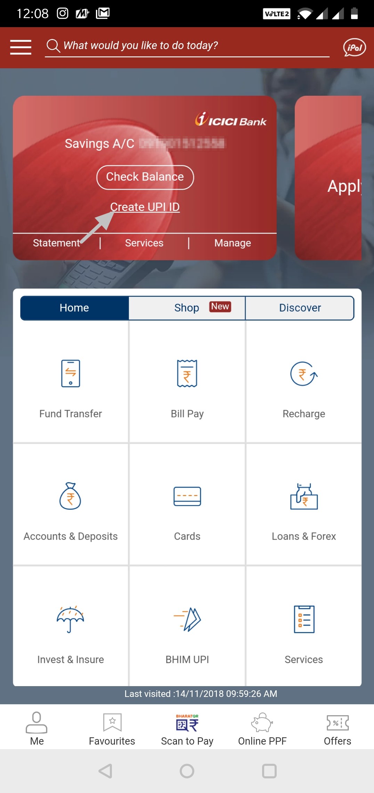

# Edited Thripti 

# EDITED ABHINAB

# About Unified Payment Interface

Unified Payments Interface (UPI) is an online payment application (app) that allows users to transfer funds between two banks without IFSC Code and beneficiary account number. You can link multiple [bank accounts](https://www.icicibank.com/) to a single platform, where you can send or receive funds using one of the following methods:

* **VPA Virtual Payment Address**: Unique payment ID to transfer and receive funds.
* **Mobile Number**: Registered mobile number.
* **Account Number & IFSC Code**: Bank IFSC code and beneficiary account number.
* **Aadhar Number**: Enrolled Aadhar number and the registered mobile number.
* **QR Code**: Scan the `QR` code through Scan & Pay and generate QR codes in the app for making payments.

> You can perform the UPI transaction through the supported bank’s app or third-party vendors like Bharat Interface for Money (BHIM), and so on. For a complete list of UPI enabled banks and third-party vendors, see UPI Live Members.

## Salient Features of UPI

1. Enables round the clock fund transfer on the same lines as IMPS
2. Unified platform to access all your bank accounts
3. Secure 2-step authentication for fund transfer
4. Hassle-free cash transaction options
5. Daily transfer limit of 2 lakhs
6. No hidden charges

| Bank | IFSC Code |
| --- | --- |
| SBI | 001 |
| CITI | 002 |
